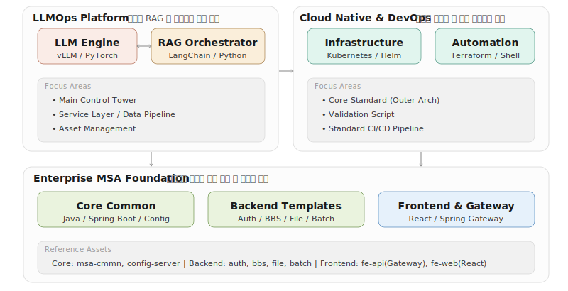

# 플랫폼 파트

**Standard Architecture & LLMOps Ecosystem**

>우리 파트는 클라우드 네이티브 기반의 **아우터 아키텍처(Outer Architecture) 표준 수립**과 **LLMOps 플랫폼 구축**을 목표로 합니다. 
>MSA 표준 소스 자산과 AI 서비스 인프라를 통합적으로 관리합니다.

---

## 기술 스택

| 분야 | 주요 목표 | 기술 스택 |
| :--- | :--- | :--- |
| **LLMOps** | 고성능 RAG 및 에이전트 체계 | `Python` `FastAPI` `VectorDB` `LLM` |
| **클라우드 네이티브** | 인프라 자동화 및 표준 수립 | `Kubernetes` `Helm` `Docker` `Shell` |
| **엔터프라이즈 MSA** | 안정적인 마이크로서비스 기반 | `Java` `Spring Boot` `React` `Gateway` |
---

## 레파지토리 분류
- **LLMOps PoC & AI Services**
   - **Main Control Tower** : LLMOps 인프라 및 체계 구축
   - **Service Layer** : AI 에이전트 및 추론 중계 API
   - **Data Pipeline** : 벡터 DB 데이터 파이프라인
   - **Asset Management** : 모델 메타데이터 및 버전 관리
- **아우터 아키텍처 & DevOps**
   - **Validation** : 아우터 아키텍처 구축 및 설정 검증
   - **Standard CI/CD** : 응용 서비스 표준 배포 파이프라인
- **MSA 베이스 템플릿 (Spring Boot & React)**
   - **Core** : 백엔드 공통모듈, 컨피그서버
   - **Backend** : 인증, 게시판, 파일관리, 배치 템플릿
   - **Frontend & Gateway** : 스프링 게이트웨이, 리액트 UI
---

   
  
  

